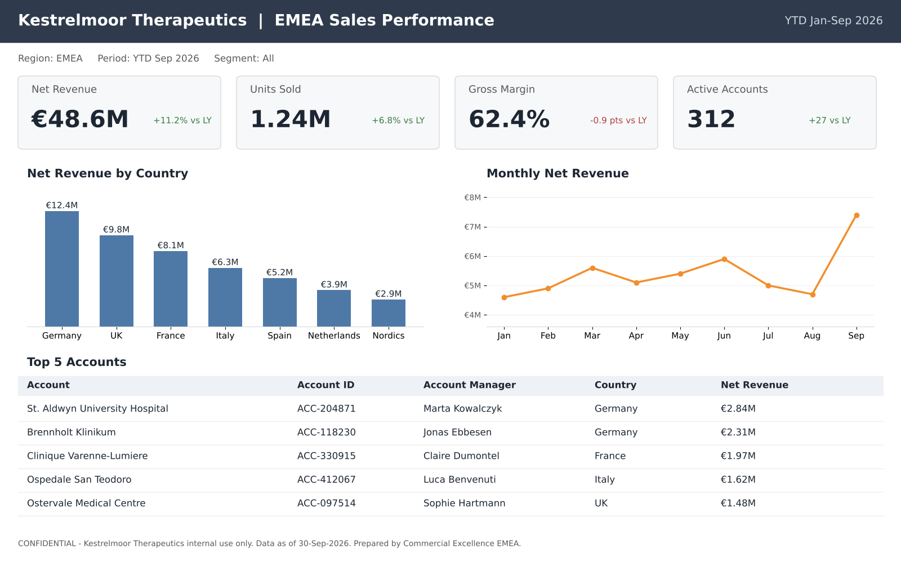
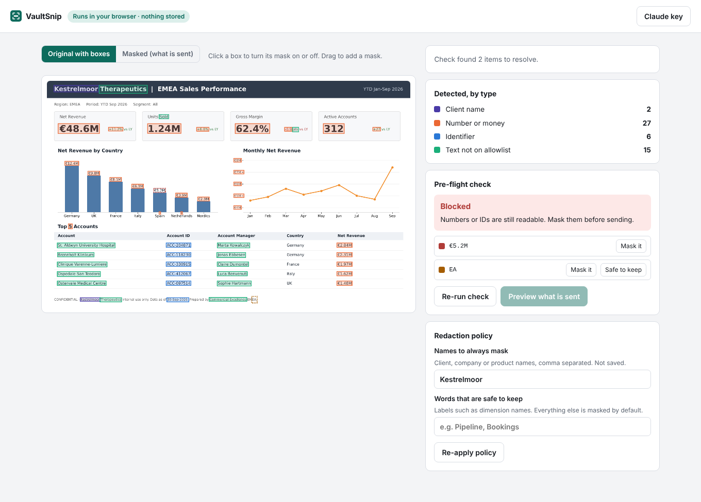
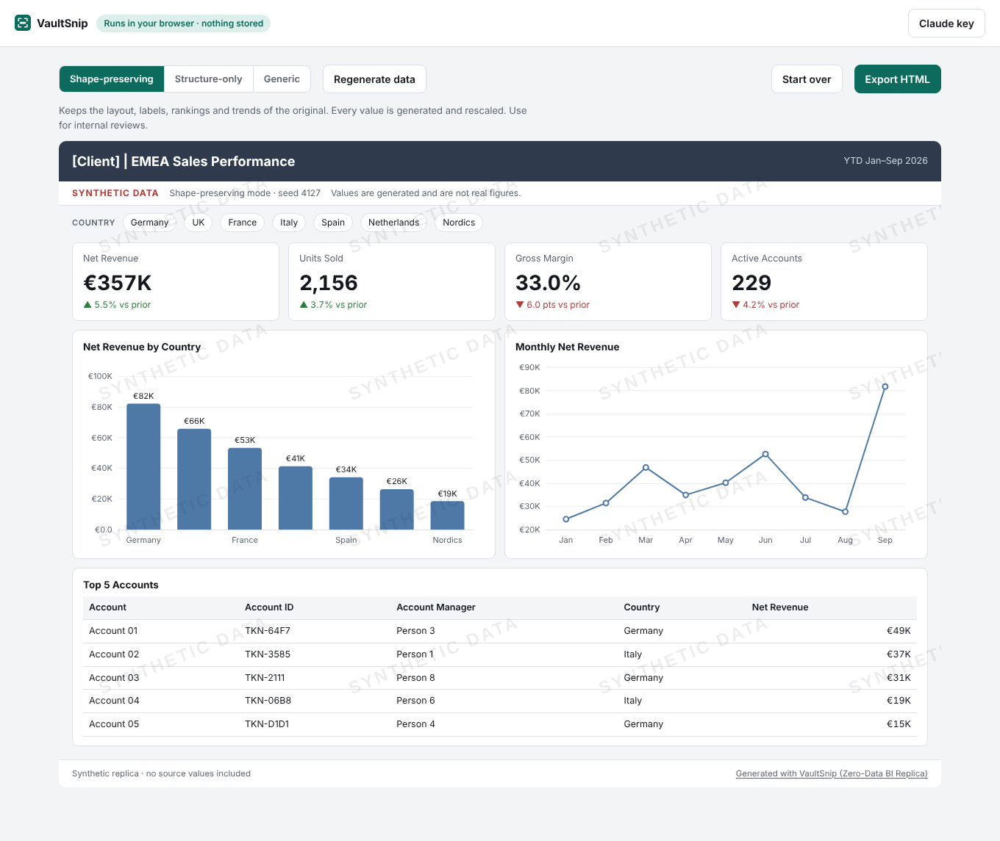
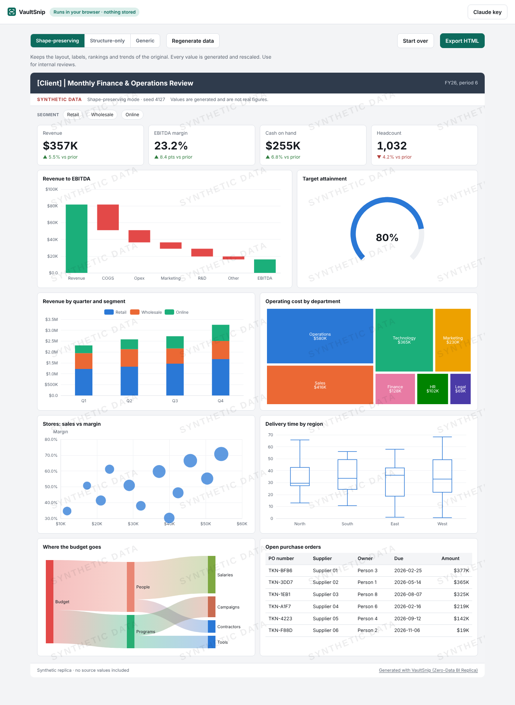

# VaultSnip: share the dashboard, not the data

*Turn sensitive report snips into client-safe replicas.*

Every week someone asks me for "a screenshot of the current dashboard". A vendor scoping a rebuild, an offshore team picking up a story, a prospect who wants to see what good looks like. And every week the same thing happens: the screenshot has real revenue, real customer names and real account IDs on it, so it either doesn't get shared, or it gets shared after twenty minutes of black boxes in PowerPoint that nobody can explore.

So I built **VaultSnip**, a free web app and browser extension that turns a snip of any dashboard or report into a watermarked, interactive replica running on generated data. The layout survives. The data doesn't.

## How it works

1. **Snip.** Click the extension icon on any report (Tableau, Power BI, Qlik, Looker, Excel, a PDF page, web analytics) and drag over the part you want. Or upload or paste an image in the web app.
2. **Mask on your device.** OCR runs inside your browser. VaultSnip masks *everything* except a short list of safe labels such as months, countries and common metric names. Names, numbers, IDs and unknown words are covered by default, so a miss means something is over-masked, not leaked.
3. **Check again before anything leaves.** A second, independent scan re-reads the masked image at higher zoom and in inverted colours. If anything readable is left, sending is blocked until you fix it. In the sample, it caught a revenue label the first pass had missed.
4. **Approve the exact payload.** You see the precise image that will be sent, and nothing else.
5. **Rebuild.** Claude reads only the masked image and returns a layout spec: chart types, labels that were left visible, and the relative shapes of bars and lines. VaultSnip then generates synthetic data and builds the replica.

## Three privacy modes

- **Shape-preserving** keeps rankings and trends but rescales every value. Good for internal design reviews.
- **Structure-only** keeps the layout and labels with random values. Good for vendors and prospects.
- **Generic** replaces titles and labels too. Good for public demos.

Every replica carries a watermark and a "synthetic data" banner that can't be switched off, and exports as a single HTML file that works offline.

It handles far more than bar charts: KPI cards, stacked columns, lines and areas, pie and donut, treemap, funnel, waterfall, scatter and bubble, heatmaps, gauges, box plots, Sankey diagrams, tables, and maps (filled, bubble, density and flow) for the world, Europe and 14 countries. Click any bar, slice, row or map region and every number on the page changes.

## The privacy promise

- No account, no backend, no database. Everything runs in the browser tab.
- The only thing that ever leaves your device is the masked image you approved, sent straight to Anthropic with **your own** API key.
- The sample dashboards need no key at all.
- The code is open source under Apache 2.0, so anyone can check these claims.

## What's next

Shapes measured directly from pixels, more map outlines, PDF and PowerPoint input, and turning the layout spec into user stories and Tableau or Power BI build plans.

## Try it

- Web app: [link]
- Chrome extension: [link] · Edge add-on: [link]
- Hugging Face Space: [link]
- Source code: https://github.com/karthikvalluri85/vaultsnip

If you work with dashboards you can't share, I'd love to hear whether this saves you an afternoon. Issues and ideas are welcome on GitHub.
